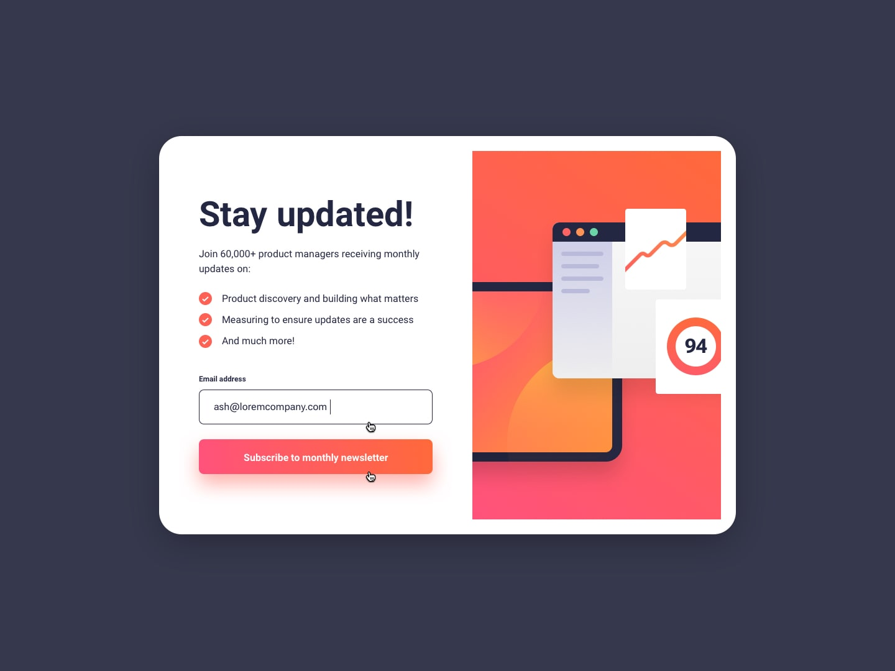
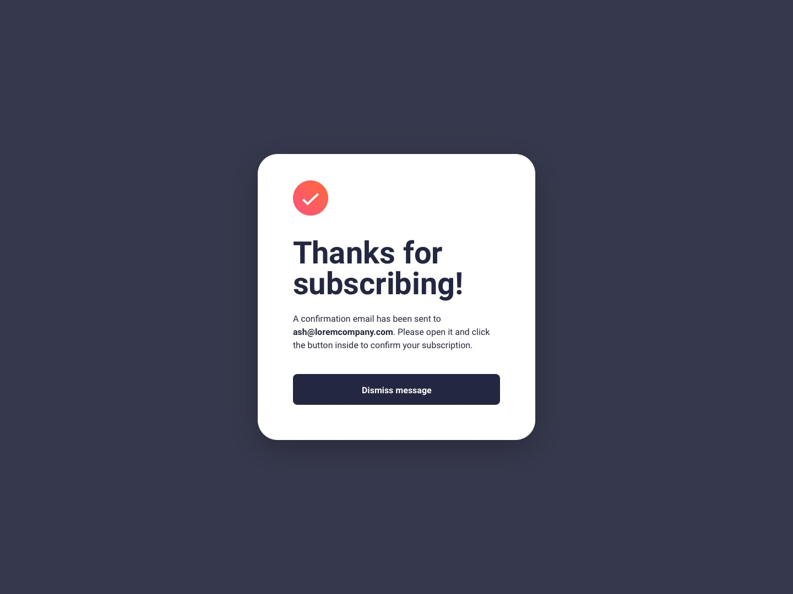
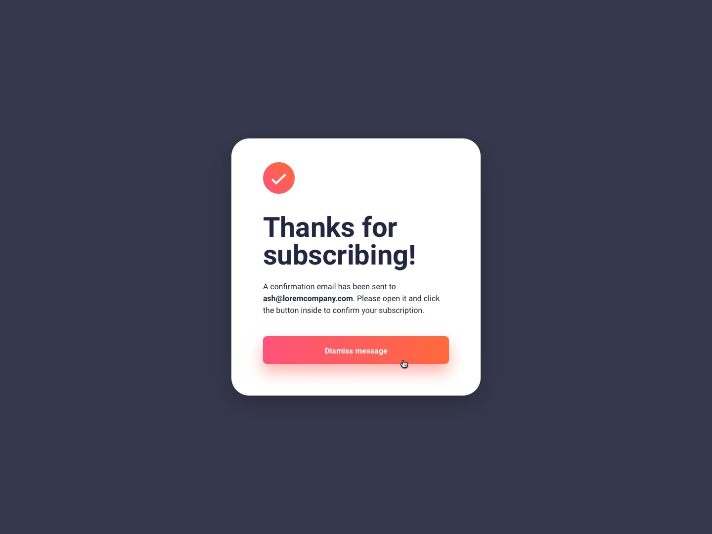
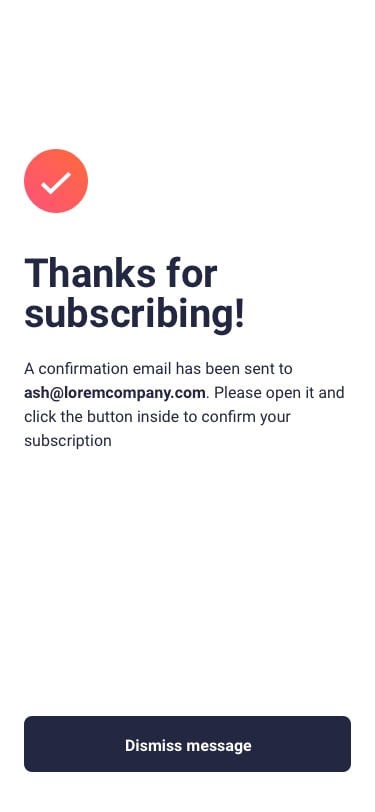

# Frontend Mentor - Solución Newsletter Sign-Up with Success Message

Esta es mi solución al desafío **Newsletter Sign-Up with Success Message** de Frontend Mentor. Este proyecto se enfoca en construir un componente de suscripción a newsletter completamente responsive con validación de correo en tiempo real, estados dinámicos de la interfaz y una pantalla de confirmación de éxito utilizando HTML, CSS y JavaScript vanilla.

El desafío fue una excelente oportunidad para practicar estructura semántica en HTML, arquitectura moderna en CSS, técnicas de diseño responsivo y manipulación del DOM sin depender de frameworks o librerías externas.

---

## Tabla de contenidos
- [Descripción general](#descripción-general)
- [El desafío](#el-desafío)
- [Diseño](#diseño)
- [Enlaces](#enlaces)
- [Mi proceso](#mi-proceso)
- [Tecnologías utilizadas](#tecnologías-utilizadas)
- [Lo que aprendí](#lo-que-aprendí)

---

## Descripción general
Este proyecto es un componente responsive de suscripción a newsletter que valida la entrada del usuario y muestra un mensaje de éxito al enviar el formulario correctamente. Se adapta tanto a dispositivos móviles como de escritorio siguiendo un enfoque mobile-first.

La interfaz incluye un formulario de suscripción con validación de correo en tiempo real, manejo dinámico de errores, estados interactivos en botones y una pantalla de confirmación que reemplaza el formulario cuando el envío es válido.

Todo el diseño visual se maneja con técnicas modernas de CSS, mientras que la validación del formulario y la gestión de estados de la interfaz se implementan con JavaScript vanilla.

---

## El desafío
Los usuarios deben poder:

- Ver el diseño óptimo según el tamaño de su pantalla.
- Experimentar un diseño responsive con enfoque mobile-first.
- Ingresar su correo electrónico y recibir retroalimentación de validación.
- Ver mensajes de error al enviar un correo inválido.
- Experimentar validación en tiempo real mientras escriben.
- Ver estados hover y focus en los elementos interactivos.
- Enviar el formulario y visualizar un mensaje de confirmación.
- Cerrar el mensaje de éxito y regresar al formulario.
- Experimentar transiciones suaves y una jerarquía visual clara.

---

## Diseño

- Diseño de escritorio  

- Estados activos  

- Éxito en escritorio  

- Éxito en escritorio (activo)

- Estados de error

- Diseño móvil  

- Éxito en móvil

---

## Enlaces
- URL del repositorio: [GitHub Repository](https://github.com/mlopezl/newsletter-sign-up-with-success-message)
- URL del sitio en vivo: [Live Demo](https://mlopezl.github.io/newsletter-sign-up-with-success-message/)

---

## Mi proceso
- Estructuré el layout utilizando elementos **semánticos de HTML5** como `section`, `form`, `label` y `button`.
- Seguí un enfoque **mobile-first**, mejorando progresivamente el diseño mediante media queries.
- Construí los layouts principalmente con **Flexbox** para alineación, espaciado y responsividad.
- Utilicé **CSS custom properties (variables)** para crear un sistema de colores consistente.
- Apliqué la **metodología BEM** para mantener un CSS modular, escalable y legible.
- Implementé efectos hover en botones usando pseudo-elementos (`::before`) y `z-index`.
- Utilicé `position: relative` y `position: absolute` para controlar efectos visuales en capas.
- Gestioné breakpoints responsivos para cambiar entre ilustraciones móviles y de escritorio.
- Implementé validación de correo en tiempo real usando **expresiones regulares (RegEx)**.
- Controlé la visibilidad de la interfaz agregando y removiendo clases dinámicamente.
- Evité el comportamiento por defecto del formulario utilizando `event.preventDefault()`.
- Separé claramente la estructura (HTML), los estilos (CSS) y la lógica (JavaScript).

---

## Tecnologías utilizadas
- HTML5
- CSS3
- JavaScript (ES6)
- Flexbox
- CSS custom properties (variables)
- Enfoque Mobile-first
- Principios de diseño responsivo
- Metodología BEM
- Manipulación del DOM
- Event listeners
- Expresiones regulares (RegEx)
- Media queries

---

## Lo que aprendí
- Estructurar componentes responsivos utilizando **HTML semántico**.
- Construir layouts flexibles con **Flexbox**.
- Organizar estilos escalables usando la **metodología BEM**.
- Crear un sistema de diseño reutilizable con **variables CSS**.
- Implementar efectos hover avanzados con pseudo-elementos y gradientes en capas.
- Escribir y aplicar **expresiones regulares** para validación personalizada de formularios.
- Gestionar el estado de la interfaz dinámicamente mediante manipulación de clases.
- Mejorar la experiencia de usuario con validación en tiempo real.
- Controlar el comportamiento del formulario usando `preventDefault()` y lógica personalizada.
- Escribir código frontend limpio, mantenible y modular sin frameworks.